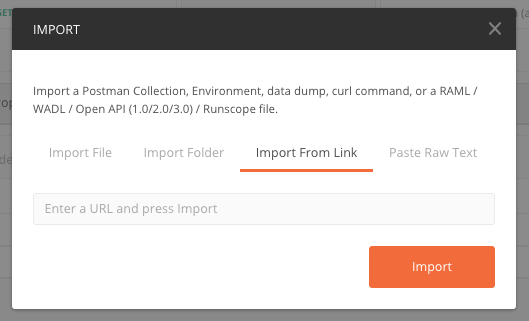
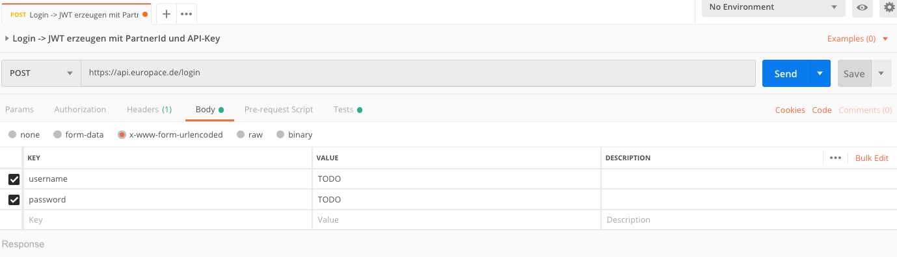

# Postman Calls für die EUROPACE APIs

Eine Übersicht aller APIs ist hier zu finden: https://developer.europace.de/

Probeaufrufe der APIs sind sehr hilfreich, um schnell einzusteigen. Dafür empfehlen wir [Postman](https://www.getpostman.com/), was auf Windows, Mac OS und Linux funktioniert.

Schritte um Postman einzurichten:
1. Postman installieren. Es ist *keine* Anmeldung erforderlich.
1. Oben links auf _Import_ Button klicken, dann auf _Import from Link_

4. Folgenden Link in die Textbox pasten: `https://raw.githubusercontent.com/europace/api-sandbox/master/EUROPACE%20API%20Calls.postman_collection.json`
5. Der ersten Call in der Collection (`Login -> JWT erzeugen  mit PartnerId und API-Key`) anklicken und auf den _body_ wechseln.
1. Dort die 2 Felder TODO ersetzen, so das bei `username`die Partner ID steht und bei `password` der API-Key.

