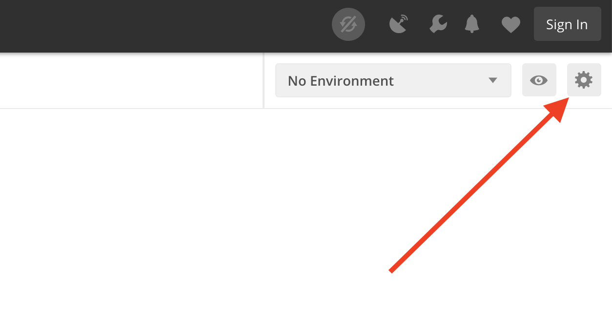
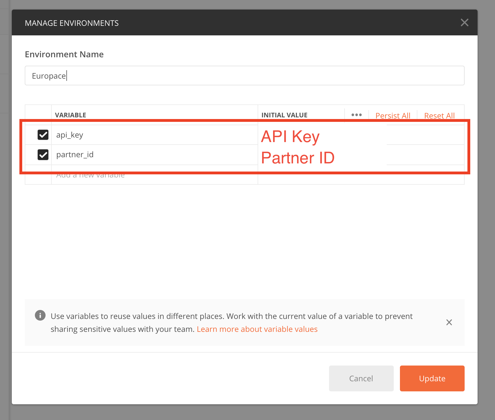
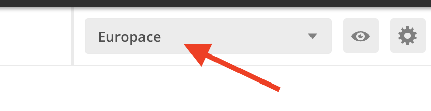

# Postman Calls für die EUROPACE APIs

Probeaufrufe (Calls) der APIs sind sehr hilfreich, um schnell einzusteigen. Dafür empfehlen wir [Postman](https://www.getpostman.com/), was auf Windows, Mac OS und Linux funktioniert.

Eine Übersicht aller APIs ist hier zu finden: https://developer.europace.de/

## 📣 Voraussetzung um diese Calls auszuführen:

1. Du benötigst eine API Zugriff. Das beinhaltet entweder:
   * OAuth Client Credentials. Wo diese herkommen ist [hier beschrieben](https://europace2.zendesk.com/hc/de/articles/360012514780).
   * eine PartnerID und einen API Key (Für eine Legacy Autorisierung).
2. Du benötigst mindestens einen Vorgang oder einen Antrag, um die Daten auszulesen.

## ✅ Schritte um Postman einzurichten

1. Postman [runterladen]((https://www.getpostman.com/)) und installieren. Es ist *keine* Anmeldung erforderlich.
1. Oben links auf _Import_ Button klicken, dann auf _Import from Link_

4. Folgenden Link in die Textbox pasten: `https://raw.githubusercontent.com/europace/api-sandbox/master/EUROPACE%20API%20Calls.postman_collection.json`

5.
1. Ein neues "Environment" anlegen in dem mehrere notwendige Variablen eingetragen werden müssen. Dafür das Icon oben rechts klicken:

1. Gebe deinem Environment einen Namen und legen darin die folgende Variablen an:

| Variablen Name | Woher bekomme ich das? |
| -------------- | ---------------------- |
| api_key        | Siehe oben unter "Voraussetzung" |
| partner_id     | Siehe oben unter "Voraussetzung" |
| CLIENT_ID      | Siehe oben unter "Voraussetzung" |
| CLIENT_SECRET  | Siehe oben unter "Voraussetzung" |
| SCOPES         | Siehe [hier](https://github.com/europace/authorization-api/blob/master/docs/scopes.md) |

1. Nach dem anlegen des Environments stelle sicher, dass es auch aktiv ist:

1. . Den Aufruf in der neuen Collection in der Linken spalte (`Get Access-Token`) anklicken
1. Bei klick auf _send_ müsste jetzt ein `access_token` zurück kommen.
